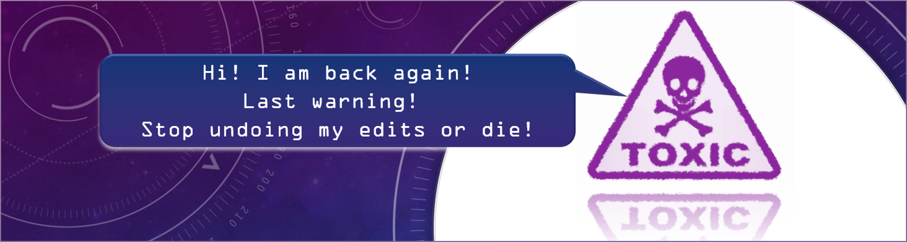

# Toxic Comment Classification Using Machine Learning and Neural Networks
*Author: Soh Hui Shan Cammy, [cammysoh@gmail.com](cammysoh@gmail.com)*

  

## Objective
The objective of our project is to build a multi-label classification model that can accurately detect different types of toxicity for each comment. There are 6 classes of toxicity - Toxic, Severe Toxic, Obscene, Threat, Insult and Identity Hate.

We would like to observe if complex approaches of word embeddings coupled with deep learning pose any significant improvement in accuracy over simpler approaches. 

For Feature Engineering, we have created word-level features using vectorization methods such as Bag-of-Words, TF-IDF representations, and GloVe word embeddings. 

We have deployed a range of classification methods, from simpler classification methods like Naïve Bayes, Logistic Regression, SVM, to more complex methods such as Neural Networks and CNN.

Data is available from *[Kaggle Toxic Comment Classification Challenge](https://www.kaggle.com/c/jigsaw-toxic-comment-classification-challenge/data)*.

## Approach
### Initial Approach and Challenges
Our initial approach is to classify the comments into 6 labels. 

We built three models and each of them has a high average accuracy of 96%. However, the micro-recall and micro-F1-score is very low for embeddings with logistic regression and neural network model.

  

From the confusion matrix, we observed that the false negatives are very high which suggest that the models are predicting toxic comments as clean. 

  

From a business perspective, if we want to use this model to flag out and remove toxic comments from a discussion forum, the model will not be effective. Therefore, we know that the high accuracy of our model is driven by the highly imbalance data where 90% of our comments are clean.

## Revised Approach
To overcome the issue of imbalanced data, we down-sample the clean comments so that the ratio of clean to toxic comments is about 60:40, from the initial 90:10. 

For the revised approach, we used a 2-level classifier. A binary classifier at the 1st level predicts just one label – Toxic or Clean. Once this is done, we passed only the comments which were predicted as Toxic to the multi-label classifier at the 2nd level to predict the other 5 labels.

  

## Results and Model Selection
Embeddings with CNN performed best for almost all metrics and both levels. 

However, we select the next best models, TF-IDF + SVM (level 1) and Binary + Logistic Regression (level 2), as our final models. The reason is because the model scores are not very far off from the best model and they have higher interpretability than CNN.

  

## Insights
Using the feature importance charts, we gather insights from our models and what makes them separate the labels based on the word importance for each label. The blue bar represents the positively related words with their respective labels. 

For example, “Threat” label has words like kill, die, hang, death which occurs primarily in the context of threatening people. 

  

## Presentation and Report 
Check out our project [presentation slides](https://www.slideshare.net/CammySoh/toxic-comment-classification-using-neural-network-and-machine-learning "AML Project Presentation") and [full report](https://github.com/cammysoh/Toxic-Comment-Classifier/blob/master/Applied%20Machine%20Learning_Project%20Report.pdf "AML Project Report") for more details. [View code on Github](https://github.com/cammysoh/Toxic-Comment-Classification-in-Python).

## Contributors
This project is done during my **Applied Machine Learning** course in [SMU MITB](https://sis.smu.edu.sg/master-it-business/analytics-track/curriculum) with [Ayushi Jaiswal](https://www.linkedin.com/in/ayushijaiswal/), [Milouni Desai](https://www.linkedin.com/in/milouni-desai/) and [Teo Yaling](https://www.linkedin.com/in/yalingt/) from Aug to Dec 2019. 

**If you like this project, do check out my other projects [here](https://github.com/cammysoh) or connect with me on [LinkedIn](https://linkedin.com/in/cammy-soh-hui-shan). Cheers!**
